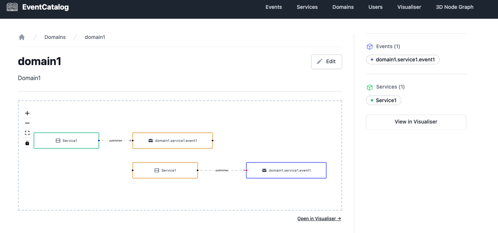
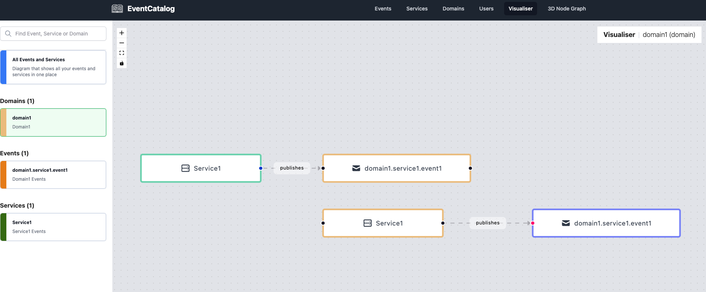

# My Event Catalog

To reproduce run:

```bash
git clone https://github.com/kbret1/EventCatalogTest.git
cd EventCatalogTest
yarn
yarn build
yarn start
```

Navigate to http://localhost:3000/domains/domain1/

Duplicates in Domain NodeGraph:


You can also see duplicates in Visualizer:

